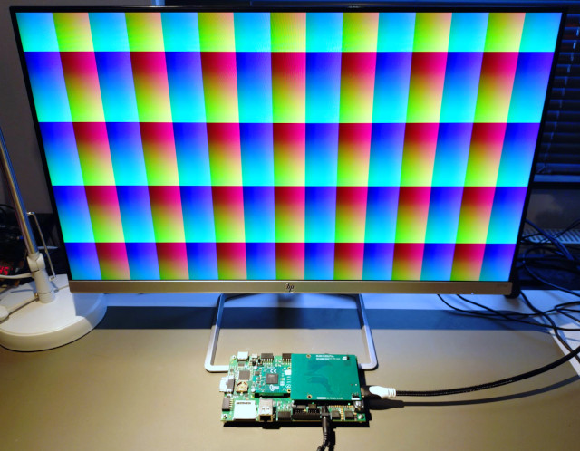

# GateMate Prallel RGB Interface

This is an implementation of a parallel RGB interface for the
[GateMate FPGAs by Cologne Chip](https://colognechip.com/programmable-logic/gatemate/).
The implementation is targeted for the
[open source FMC Video IO card](https://github.com/kschauwecker/fmc_video_io_card/).

Please see the [blog post on Elektronaut](https://elektronaut.tech/en/fpga/driving-full-hd-video-with-the-cologne-chip-gatemate-fpga/)
for more details on this project.

The motivation for implementing a parallel RGB interface on this FPGA is that the FPGA
IOs don't support the TMDS standard, which is required for HDMI. There have been some demonstrations
showing that it is still possible to drive an HDMI signal through the FPGA IOs for low resolutions,
but these approaches are unlikely to work for high-resolution / high-frame-rate modes.

The targeted FMC card has as a parallel RGB to HDMI converter IC (TFP410 from Texas Instruments).
With that it is possible to drive a high-resolution HDMI output directly from the FPGA.

The IP is capable to drive 1080p @ 60 Hz or 720p @ 60 Hz. Timing closure is even achieved
when using parameters `fpga_mode=economy` and `time_mode=worst`.

## Configurations

The implementation supports a 24-bit parallel bus (single clock edge) or a 12-bit bus (using DDR).
The internal pipeline can either process 1 or 2 pixels per clock cycle, and it can drive a
differential or single ended clock. Not all configurations work. Please refer to the list below.

### Confirmed working configurations:
* 1080p, 2 pixels per clock, 24-bit bus, differential clock
* 720p,  2 pixels per clock, 12-bit bus, single-ended clock
* 720p,  1 pixels per clock, 24-bit bus, differential clock
* 720p,  2 pixels per clock, 24-bit bus, differential clock
* 720p,  1 pixels per clock, 24-bit bus, single-ended clock

### Partially working (with glitches):
* 1080p, 2 pixels per clock, 24-bit bus, single-ended clock
* 1080p, 2 pixels per clock, 12-bit bus, single-ended clock
* 720p,  2 pixels per clock, 24-bit bus, single-ended clock

### Not working:
* 1080p, 1 pixels per clock, any bus-width/clocking; reason: no timing closure
* 1080p, 2 pixels per clock, 12-bit bus, differential clock; reason: unknown
* 720p,  2 pixels per clock, 12-bit bus, differential clock; reason: unknown

### Not implemented:
* 1 pixel per clock, 12-bit bus, any video mode / clocking
